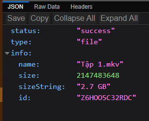
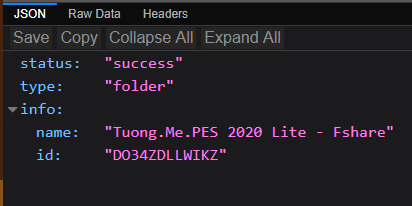
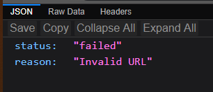
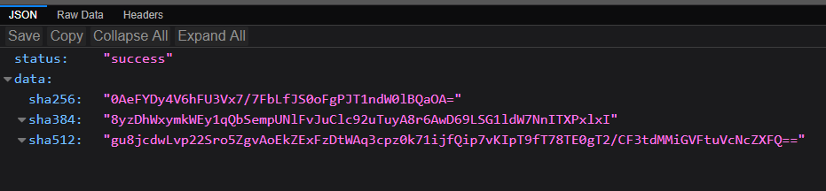
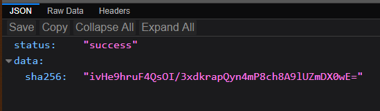
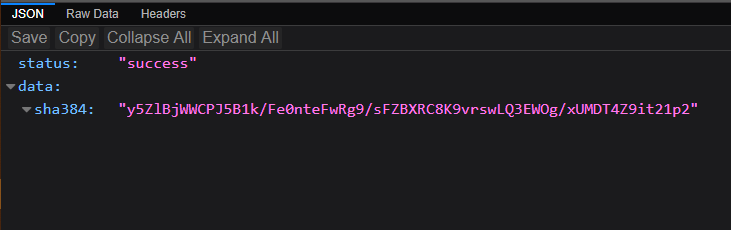
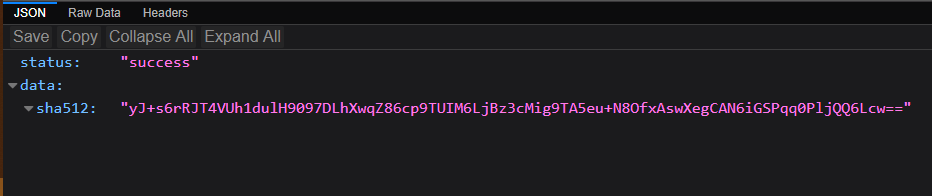

# Movie ratings:
## IMDB: [apis.delnegend.com/imdb](https://apis.delnegend.com/imdb)
- Param: id (string), raw (boolean)
- Demo:
  - https://apis.delnegend.com/imdb?id=tt9140554 (Loki 2021)
  - https://apis.delnegend.com/imdb?id=tt3228774 (Curella 2021)
## RottenTomatoes: [apis.delnegend.com/rottentomatoes](https://apis.delnegend.com/rottentomatoes)
- Param: url (string), raw (boolean)
- Demo: 
  - https://apis.delnegend.com/rottentomatoes?url=https://www.rottentomatoes.com/m/black_widow_2021
  - https://apis.delnegend.com/rottentomatoes?url=https://www.rottentomatoes.com/m/the_suicide_squad
## Param `raw` để làm gì?
  - Do nhu cầu của mình là chỉ cần lấy điểm review với số lượt đánh giá, những dữ liệu còn lại như đạo diễn, diễn viên, review... mình không có nhu cầu, nhưng phòng trường hợp có bạn quan tâm nên mình để lại.
  - RottenTomatoes audience score hiện chỉ mới lấy được điểm của phim truyền hình dài tập, chưa lấy được của phim lẻ, chưa hẹn ngày fix.

# Fshare: [apis.delnegend.com/fshare](https://apis.delnegend.com/fshare)
- Param:
  - url: link thư mục hoặc file fshare
  - fastid *(optional)*: để true nếu chỉ cần lấy ID
- Demo
  1. Trường hợp link hợp lệ

      

      

  2. Trường hợp link không hợp lệ

      

# SRI Generator
### Param:
- url: link file css/js cần generate hash 
- sha *(optional)*: 256, 384 hoặc 512 tuỳ nhu cầu
### Demo

1. Trường hợp chỉ có url

    

2. Trường hợp có param "sha"

    

    

    
